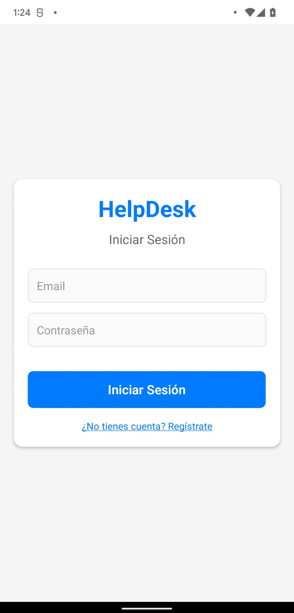
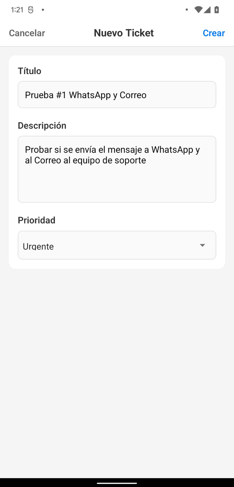
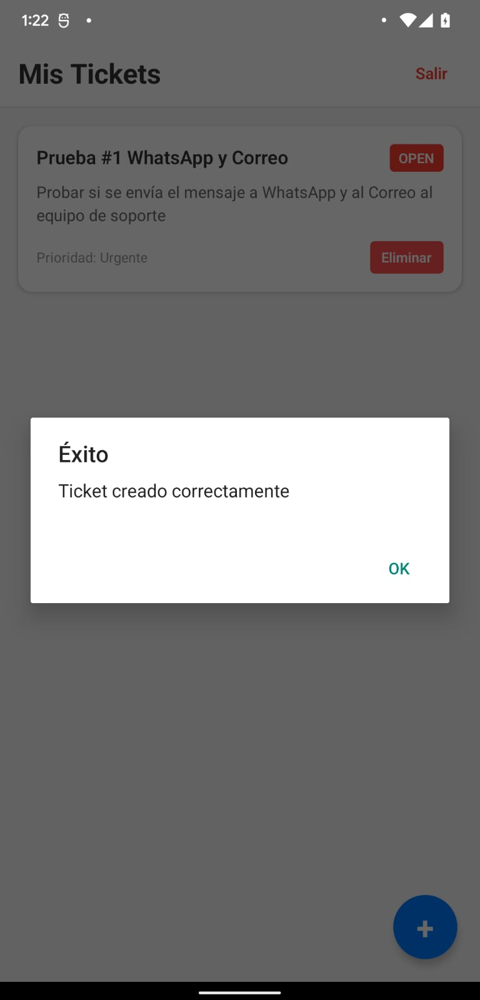
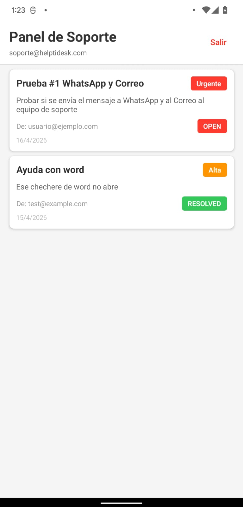
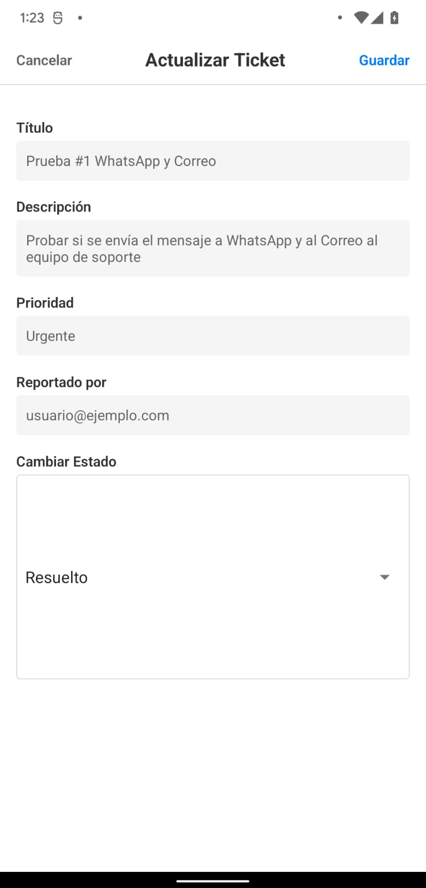
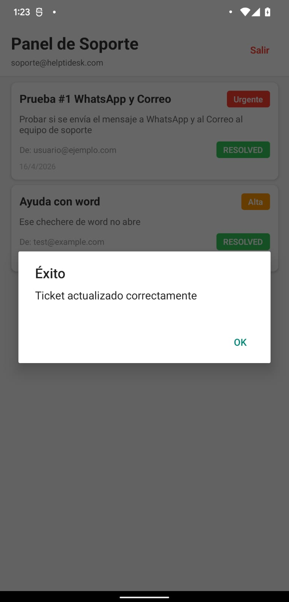
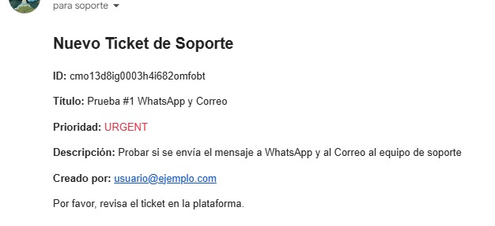
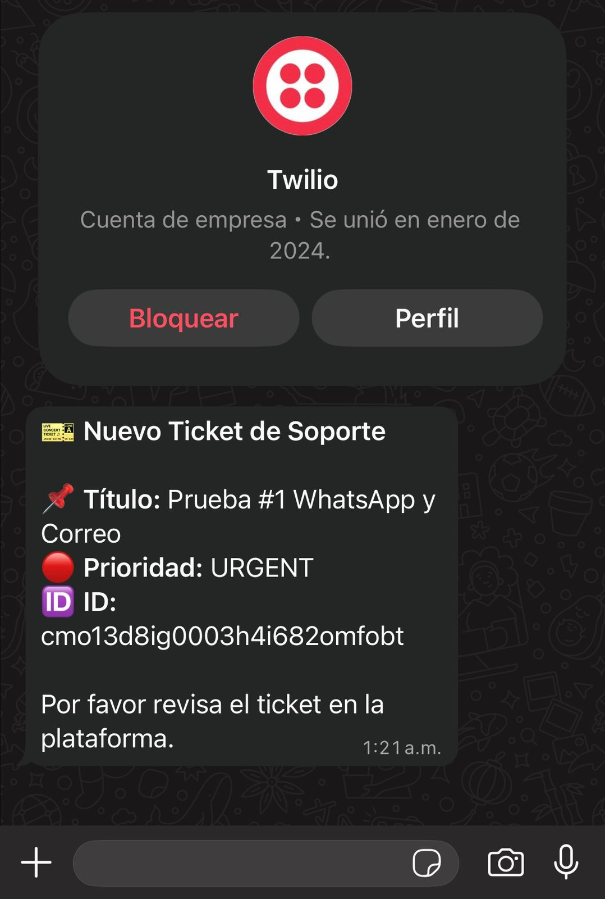

# 🎫 HelpTIDesk - Sistema de Gestión de Tickets de Soporte

Aplicación **full-stack** profesional para gestión de incidencias TI. Usuarios reportan problemas, personal de soporte recibe notificaciones en tiempo real (Email + WhatsApp), y rastrea resoluciones.

**Live Demo Workflow:** Usuario crea ticket → Personal de soporte recibe notificación WhatsApp → Soporte resuelve ticket → Usuario ve actualización en tiempo real.

---

## 🚀 Stack Tecnológico

| Componente | Tecnología |
|-----------|-----------|
| **Backend** | NestJS 11.0.1, Prisma ORM, PostgreSQL |
| **Mobile App** | React Native 0.85, Expo, TypeScript |
| **Autenticación** | JWT con roles y metadata |
| **Notificaciones** | Nodemailer (Email) + Twilio (WhatsApp) |
| **Database** | PostgreSQL 16 en Docker |
| **DevOps** | Docker Compose, npm |

---

## 📱 Capturas de Pantalla

### Login


### Usuarios Regulares - Crear Ticket



### Personal de Soporte - Panel de Control




### Notificaciones



---

## ✨ Características Principales

### 👤 Para Usuarios Regulares
- ✅ Registro e inicio de sesión seguro (JWT)
- ✅ Crear tickets de soporte con título, descripción y prioridad
- ✅ Ver historial de sus propios tickets
- ✅ Recibir actualizaciones de estado en tiempo real
- ✅ Interfaz móvil intuitiva con React Native

### 👨‍💼 Para Personal de Soporte
- ✅ Dashboard especializado: ver solo tickets asignados
- ✅ Cambiar estado de tickets (OPEN → IN_PROGRESS → RESOLVED → CLOSED)
- ✅ Recibir notificaciones automáticas por Email + WhatsApp
- ✅ Ver detalles del usuario que reportó
- ✅ Gestión eficiente de múltiples incidencias

### 🔐 Para Administradores
- ✅ Acceso completo: ver todos los usuarios y tickets
- ✅ Gestión de personal de soporte
- ✅ Reportes y auditoría
- ✅ Control de roles y permisos

---

## 📊 Arquitectura

### Base de Datos (Prisma Schema)
```prisma
User {
  id: String @id @default(cuid())
  email: String @unique
  password: String (hasheado con bcrypt)
  role: Role (USER, ADMIN)
  isSupport: Boolean (recibe notificaciones)
  phone: String? (para WhatsApp)
  tickets: Ticket[]
  createdAt: DateTime
}

Ticket {
  id: String @id
  title: String
  description: String
  status: Status (OPEN, IN_PROGRESS, RESOLVED, CLOSED)
  priority: Priority (LOW, MEDIUM, HIGH, URGENT)
  userId: String
  user: User
  createdAt: DateTime
  updatedAt: DateTime
}
```

### Endpoints de API

#### Autenticación
- `POST /auth/register` - Registrar nuevo usuario
- `POST /auth/login` - Iniciar sesión (devuelve JWT)

#### Tickets
- `GET /tickets` - Listar tickets (filtrado por rol)
- `POST /tickets` - Crear ticket (requiere JWT)
- `GET /tickets/:id` - Ver detalles del ticket
- `PUT /tickets/:id` - Actualizar estado del ticket
- `DELETE /tickets/:id` - Eliminar ticket

#### Usuarios (Admin only)
- `GET /users` - Listar todos los usuarios
- `GET /users/support/list` - Listar personal de soporte
- `GET /users/:id` - Ver datos de usuario específico

---

## 🔄 Flujo Completo de Uso

### 1. Usuario Regular Reporta Problema
```
Usuario (usuario@ejemplo.com) abre app
  ↓ Login con credenciales
  ↓ Presiona "+ Crear Ticket"
  ↓ Ingresa: Título, Descripción, Prioridad
  ↓ Backend crea ticket en BD
  ↓ Backend envía notificación WhatsApp a soporte
  ↓ "Ticket creado exitosamente" ✅
```

### 2. Personal de Soporte Recibe Notificación
```
📱 Recibe mensaje WhatsApp:
   "🎫 Nuevo Ticket de Soporte
    📌 Título: Mi impresora no funciona
    🔴 Prioridad: Urgente
    🆔 ID: xyz123"
    
  ↓ Login en app (soporte@helptidesk.com)
  ↓ Ve SupportDashboardScreen automáticamente
  ↓ Ve lista de tickets asignados
```

### 3. Soporte Resuelve y Actualiza Estado
```
Presiona sobre el ticket
  ↓ Modal se abre con detalles
  ↓ Cambia estado: OPEN → IN_PROGRESS → RESOLVED
  ↓ Presiona "Guardar cambios"
  ↓ Backend actualiza estado en BD
  ✅ Ticket marcado como resuelto
```

### 4. Usuario Ve Actualización
```
Usuario recarga la app
  ↓ Ve estado: "RESOLVED" en verde
  ✅ Problema solucionado
```

---

## 🛠️ Instalación y Setup

### Prerequisites
- Node.js 18+
- Docker & Docker Compose
- Android Studio (para emulador) o dispositivo Android físico
- Git

### Backend Setup

```bash
# 1. Clonar repo
git clone <repo>
cd HelpTIDesk

# 2. Instalar dependencias backend
cd backend
npm install

# 3. Crear archivo .env
cp .env.example .env
# Editar .env con tu DATABASE_URL si es necesario

# 4. Generar cliente Prisma
npx prisma generate

# 5. Crear migraciones (crear tablas en BD)
npx prisma migrate dev --name init
```

### Database Setup

```bash
# Desde raíz del proyecto
# Inicia PostgreSQL en Docker
docker compose up -d postgres

# Espera 5 segundos a que inicie completamente
# Verifica que postgres esté corriendo
docker compose ps
```

### Backend - Ejecutar Localmente

```bash
cd backend

# Desarrollo (watch mode)
npm run start:dev

# Deberías ver:
# ✅ Prisma connected to database
# ✅ Application is running on: http://localhost:3000
```

### Mobile App Setup

```bash
# Desde raíz
cd app

# Instalar dependencias
npm install --legacy-peer-deps

# Iniciar Metro bundler
npm start

# En Android Studio:
# 1. Abre emulador o conecta dispositivo
# 2. Presiona 'a' en terminal para instalar apk en Android
# 3. App se abrirá automáticamente
```

---

## 👥 Usuarios de Prueba (después de `npm run seed`)

### Admin
```
Email: admin@helptidesk.com
Password: admin123
Rol: ADMIN + isSupport
Acceso: Todos los tickets y usuarios
```

### Personal de Soporte
```
Email: soporte@helptidesk.com
Password: soporte123
Rol: ADMIN + isSupport
Acceso: SupportDashboardScreen
Teléfono WhatsApp: +573152212196
```

### Usuario Regular
```
Email: usuario@ejemplo.com
Password: usuario123
Rol: USER (isSupport: false)
Acceso: TicketsScreen (crear y ver sus tickets)
```

---

## 📧 Configurar Notificaciones

### Email (Nodemailer + Gmail)

1. Habilitar autenticación 2FA en tu cuenta Gmail
2. Generar contraseña de aplicación en: https://myaccount.google.com/apppasswords
3. Actualizar `.env`:
```env
EMAIL_HOST=smtp.gmail.com
EMAIL_PORT=587
EMAIL_SECURE=false
EMAIL_USER=tu-email@gmail.com
EMAIL_PASSWORD=contraseña-app-generada
```
4. Backend enviará emails automáticamente cuando se creen tickets

### WhatsApp (Twilio - Sandbox GRATIS)

1. Crear cuenta gratis en: https://www.twilio.com/try-twilio
2. Ir al Sandbox de WhatsApp: https://console.twilio.com/us/account/messaging/whatsapp/sandbox
3. Copiar credenciales:
   - Account SID
   - Auth Token
   - Twilio Phone Number (número de sandbox)
4. Actualizar `.env`:
```env
TWILIO_ACCOUNT_SID=AC...
TWILIO_AUTH_TOKEN=token...
TWILIO_PHONE_NUMBER=+14155...
```
5. Actualizar número de prueba en `prisma/seed.ts` y ejecutar:
```bash
npm run seed
```

**Nota:** Sandbox es gratis pero tiene limitaciones (solo números registrados). Para producción, compra un número en Twilio.

---

## 🔐 Sistema de Permisos

### Niveles de Acceso

| Acción | USER | ADMIN (isSupport) | ADMIN (No-support) |
|--------|------|-------------------|-------------------|
| Ver propios tickets | ✅ | ✅ | ✅ |
| Ver tickets asignados | ✅ | ✅ | ✅ |
| Ver TODOS los tickets | ❌ | ✅ | ✅ |
| Crear tickets | ✅ | ✅ | ✅ |
| Actualizar tickets | ✅ (solo suyos) | ✅ (todos) | ✅ (todos) |
| Ver lista de usuarios | ❌ | ✅ | ✅ |
| Recibir notificaciones | ❌ | ✅ | ❌ |

---

## 📱 Estructura del Proyecto

```
HelpTIDesk/
├── backend/                          ← API REST
│   ├── src/
│   │   ├── auth/                     ← JWT, login, registro
│   │   ├── tickets/                  ← CRUD de tickets
│   │   ├── users/                    ← Gestión de usuarios
│   │   ├── notifications/            ← Email + WhatsApp
│   │   ├── prisma/                   ← ORM config
│   │   └── app.module.ts             ← Root module
│   ├── prisma/
│   │   ├── schema.prisma             ← Modelo de datos
│   │   └── seed.ts                   ← Datos de prueba
│   ├── .env.example                  ← Variables template
│   └── package.json
│
├── app/                              ← React Native
│   ├── src/
│   │   ├── screens/
│   │   │   ├── LoginScreen.tsx
│   │   │   ├── TicketsScreen.tsx     ← Para usuarios
│   │   │   └── SupportDashboardScreen.tsx ← Para soporte
│   │   ├── services/
│   │   │   ├── api.ts                ← Cliente HTTP
│   │   │   └── storage.ts            ← LocalStorage
│   │   ├── context/
│   │   │   └── AuthContext.tsx       ← Estado global
│   │   └── types/
│   │       └── index.ts              ← TypeScript interfaces
│   ├── App.tsx                       ← Router principal
│   └── package.json
│
├── docker-compose.yml                ← PostgreSQL
└── README.md                         ← Este archivo
```

---

## 🚀 Deployment

### Backend a Railway

1. Crear cuenta en https://railway.app
2. Conectar repo de GitHub
3. Crear ambiente y servicio PostgreSQL
4. Configurar variables de entorno:
   ```
   DATABASE_URL=postgresql://...
   JWT_SECRET=tu-secret-key
   NODE_ENV=production
   ```
5. Deploy automático en push a main

### Mobile a Expo EAS

```bash
cd app
npm install -g eas-cli
eas build --platform android --type apk
```

Genera APK listo para subir a Google Play Store.

---

## 🧪 Testing

```bash
# Backend - Tests unitarios
cd backend
npm run test

# Ver base de datos (GUI)
npx prisma studio

# Re-sincronizar datos de prueba
npm run seed
```

---

## 📈 Performance & Escalabilidad

- ✅ Índices en BD (email único, userId)
- ✅ Validación con DTOs
- ✅ JWT sin estado (stateless)
- ✅ Caché en cliente (AsyncStorage)
- ✅ Compresión de bundle (Metro)

---

## 🤝 Contribuciones

Para futuras mejoras:
- [ ] Sistema de categorías de tickets
- [ ] Escalado automático en Cloud
- [ ] Dashboard de analytics
- [ ] Integración con Slack/MS Teams
- [ ] Pruebas E2E con Cypress

---

## 📄 Licencia

MIT - Libre para uso personal y comercial

---

## ✅ CheckList de Configuración

- [ ] Backend corriendo en http://localhost:3000
- [ ] PostgreSQL en Docker corriendo
- [ ] BD sincronizada con `npm run seed`
- [ ] App móvil compilando sin errores
- [ ] Dispositivo/emulador conectado
- [ ] Email configurado (opcional)
- [ ] WhatsApp/Twilio configurado (opcional)
- [ ] Primer ticket creado exitosamente ✨

